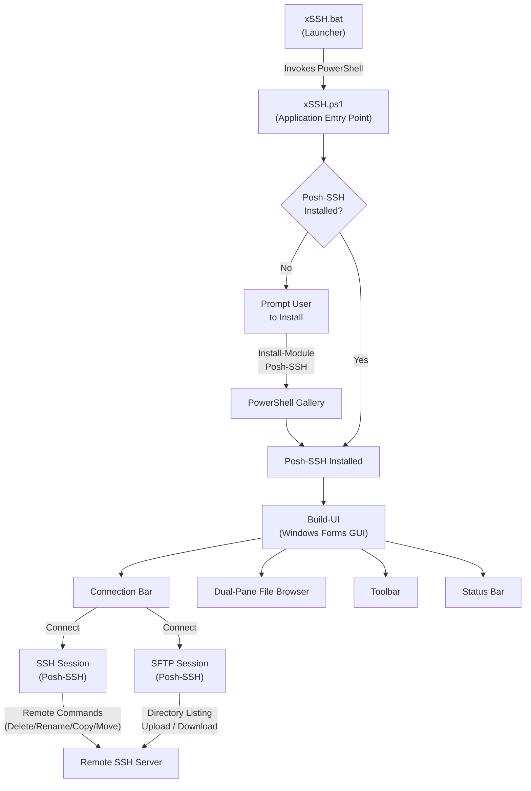
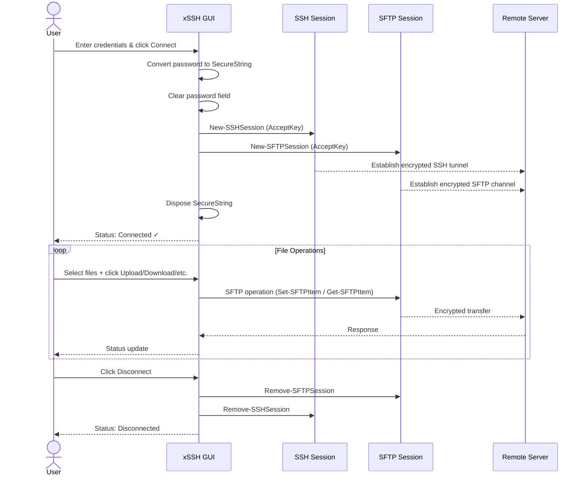
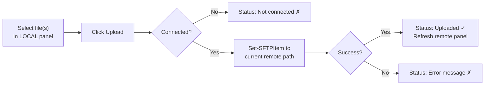
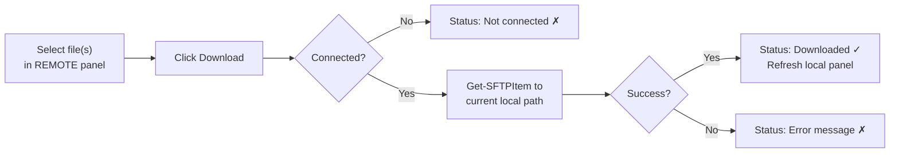
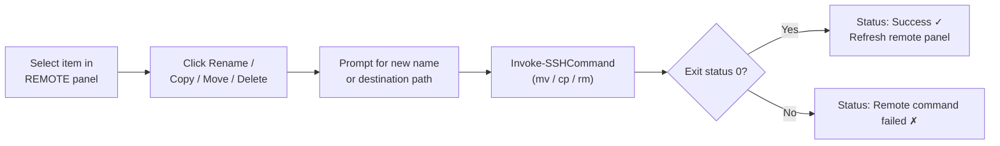

# xSSH File Transfer Client

> A lightweight, GUI-based SFTP/SSH file manager for Windows — built entirely in PowerShell with zero third-party installers.

[](https://www.gnu.org/licenses/gpl-3.0)
[](https://docs.microsoft.com/en-us/powershell/)
[](https://www.microsoft.com/)

---

## Table of Contents

- [Project Overview](#project-overview)
- [Security & Privacy Benefits](#security--privacy-benefits)
- [Features & Advantages](#features--advantages)
- [Installation](#installation)
- [Usage Guide](#usage-guide)
- [Application Architecture](#application-architecture)
- [File Transfer Workflows](#file-transfer-workflows)
- [License](#license)

---

## Project Overview

**xSSH File Transfer Client** (`xSSH.ps1`) is a native Windows GUI application that provides a dual-pane file manager interface for transferring files to and from remote servers over a fully encrypted SSH/SFTP connection. It is written entirely in PowerShell using Windows Forms and powered by the [Posh-SSH](https://github.com/darkoperator/Posh-SSH) module.

The client is distributed as just two files:

| File | Role |
|------|------|
| `xSSH.ps1` | Core application — all GUI, logic, and SSH/SFTP operations |
| `xSSH.bat` | Launcher — double-click to start; shows errors if startup fails |

There is no installer, no registry modification, and no binary to trust. Everything the application does is readable, auditable PowerShell source code.

---

## Security & Privacy Benefits

xSSH File Transfer Client has been designed with a security-first philosophy at every layer of the stack.

### Encrypted Transport
All file transfers and remote commands are executed over SSH/SFTP — an industry-standard encrypted protocol. No data is ever transmitted in plaintext. The underlying Posh-SSH library establishes a cryptographically secured channel before any operation begins.

### Credential Hygiene
Passwords are handled with deliberate care:

- The password field uses `UseSystemPasswordChar` to mask input at the UI level.
- Immediately after the connect button is pressed, the plaintext password is converted to a `SecureString` object and the UI field is **cleared from memory** before the connection is even attempted.
- The `SecureString` is explicitly **disposed** once the SSH session is established, minimising the window during which credentials exist in managed memory.

```powershell
$secPw = ConvertTo-SecureString $rawPw -AsPlainText -Force
$script:tbPw.Text = ""        # Clear password from UI immediately
$ok = Connect-SSH ... $secPw
$secPw.Dispose()              # Dispose SecureString after use
```

### No Credential Storage
xSSH **never** writes credentials to disk — no configuration files, no registry keys, no plaintext secrets. Each session requires explicit authentication.

### No Telemetry or Network Callbacks
The application makes no outbound connections other than the SSH session you initiate. There is no analytics, update-checking, or telemetry of any kind.

### Minimal Attack Surface
The application is distributed as plain `.ps1` and `.bat` source files. There are no compiled binaries, no DLLs, and no obfuscated code. The entire codebase is human-readable and auditable before execution.

### Dependency Transparency
The only external dependency is `Posh-SSH`, installed from the official [PowerShell Gallery](https://www.powershellgallery.com/) under your user scope (`-Scope CurrentUser`) — no elevated privileges are required or requested.

### Destructive Operation Safeguards
Remote delete operations trigger a confirmation dialog before execution, preventing accidental data loss:

> *"Permanently delete 'filename' from the server? This action cannot be undone."*

---

## Features & Advantages

- **Dual-pane file browser** — local filesystem on the left, remote SFTP filesystem on the right; navigate both sides simultaneously.
- **Multi-file upload** — select multiple local files and upload them all in a single operation.
- **Download** — transfer remote files to the current local directory.
- **Server-side operations** — Rename, Copy, and Move files and directories directly on the remote server without downloading them first.
- **Remote delete** — remove files or entire directory trees from the server (`rm -f` / `rm -rf`), with a confirmation prompt.
- **Navigable path bars** — type a path directly into either panel's address bar and press Enter to jump there instantly.
- **Browse button** — opens a native folder picker to set the local working directory.
- **Auto-install dependency** — if Posh-SSH is not present, the application offers to install it automatically from PowerShell Gallery; no manual setup required.
- **GitHub Light theme** — clean, low-contrast UI using the same colour palette as GitHub's web interface; easy on the eyes during extended sessions.
- **Zero-install, zero-elevation** — runs entirely in user space; no administrator rights, no installer, no registry changes.
- **Fully auditable source** — two plain-text files; read the code before you run it.
- **Portable** — copy the two files to any Windows machine and run. No configuration migration needed.

---

## Installation

### Prerequisites

| Requirement | Details |
|-------------|---------|
| Windows OS | Windows 10 / 11 or Windows Server 2016+ |
| PowerShell | Version **5.1** or later (pre-installed on Windows 10+) |
| Internet access | Required only on first run, to install Posh-SSH from PowerShell Gallery |

### Steps

**1. Download the files**

Clone the repository or download both files directly:

```
xSSH.ps1
xSSH.bat
```

Both files must reside in the **same folder**.

```
📁 Any folder of your choice\
├── xSSH.ps1
└── xSSH.bat
```

**2. (Optional) Unblock the files**

Windows may flag files downloaded from the internet. To remove the security block, right-click each file → **Properties** → check **Unblock** → **OK**. Alternatively, run the following in PowerShell from that directory:

```powershell
Unblock-File -Path ".\xSSH.ps1"
Unblock-File -Path ".\xSSH.bat"
```

**3. Launch the application**

Double-click `xSSH.bat`. The launcher will:

1. Verify that `xSSH.ps1` is present in the same directory.
2. Invoke PowerShell with `–ExecutionPolicy Bypass` so no system-wide policy changes are needed.
3. On first run — if Posh-SSH is not installed — display a prompt offering to install it automatically. Click **Yes**.
4. Open the xSSH File Transfer Client window.

> **Tip:** If a security warning from Windows Defender SmartScreen appears, click **More info** → **Run anyway**. This is expected for unsigned PowerShell scripts downloaded from the internet.

---

## Usage Guide

### Connecting to a Server

Fill in the connection bar at the top of the window:

| Field | Description | Default |
|-------|-------------|---------|
| **Host / IP** | Hostname or IP address of the SSH server | — |
| **Port** | SSH port | `22` |
| **Username** | Remote account username | — |
| **Password** | Account password (masked) | — |

Click **Connect** or press **Enter** in the password field. The status bar at the bottom will confirm the connection.

### Navigating the File Browser

The dual-pane view shows **LOCAL** on the left and **REMOTE** on the right.

- **Double-click a `[DIR]` item** to enter that directory.
- **Double-click `.. [up]`** to move to the parent directory.
- **Type a path** in the address bar above either panel and press **Enter** to jump directly to that location.
- Click **Browse** (local panel) to open a native folder picker.
- Click **Refresh** (remote panel) to reload the remote directory listing.

### Toolbar Operations

| Button | Action | Selection Required |
|--------|--------|--------------------|
| **Upload** | Upload selected local file(s) to the current remote directory | One or more local files |
| **Download** | Download selected remote file(s) to the current local directory | One or more remote files |
| **Delete** | Delete selected remote item (file or directory) — prompts for confirmation | One remote item |
| **Rename** | Rename selected remote item in place | One remote item |
| **Copy** | Copy selected remote item to another directory on the server | One remote item |
| **Move** | Move selected remote item to another directory on the server | One remote item |

### Disconnecting

Click **Disconnect** in the connection bar. All SSH and SFTP sessions are terminated cleanly. The connection fields become editable again for a new session.

---

## Application Architecture

The following diagram illustrates the high-level architecture of xSSH File Transfer Client.



### Session Lifecycle



---

## File Transfer Workflows

### Uploading a File



### Downloading a File



### Server-Side Operations (Rename / Copy / Move / Delete)



---

## License

This project is licensed under the **GNU General Public License v3.0** — see [https://www.gnu.org/licenses/gpl-3.0.html](https://www.gnu.org/licenses/gpl-3.0.html) for the full license text.
